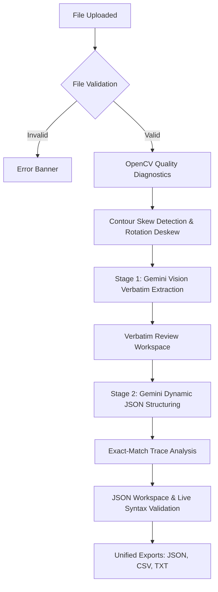

# Nobeth Universal OCR

> **Extract. Understand. Structure.**  
> A standalone, single-server document intelligence workstation powered by **Google Gemini 3.1 Flash-Lite** and **Streamlit**.

---

## ⚡ Quick Start for Beginners

If you are on Windows, you don't need to write commands, set up virtual environments, or manage packages.

1. Create a text file in the project folder named `.env` and add your Gemini API Key like this:
   ```ini
   GEMINI_API_KEY=your_actual_key_here
   ```
2. Double-click **[run.bat](file:///g:/Nobeth%20Analytics/Projects/Nobeth%20Universal%20OCR/Codebase/run.bat)** in the project folder.
3. The launcher will automatically set up the system, install libraries, find a free port, and open your web browser.
4. Upload a document (such as a receipt, invoice, or PDF form) and click **Run Gemini Vision Extraction**.

---

## 🌟 Overview

**Nobeth Universal OCR** is a minimal, high-accuracy document intelligence workspace designed to extract and structure information from almost any image or document format without rigid, pre-defined templates.

Traditional OCR systems enforce strict coordinate mappings or hardcoded schemas (e.g. only processing specific invoice templates). Nobeth Universal OCR addresses this by leveraging a **universal two-stage architecture** built on top of LLMs and Computer Vision:

1. **Stage 1 (Verbatim Raw Extraction)**: Gemini Vision inspects the document directly and extracts text, tabular layouts, codes, and handwriting with verbatim precision.
2. **Stage 2 (Dynamic Structuring)**: Gemini analyzes the verbatim transcription, dynamically infers the document type (e.g., receipt, ID card, medical form), structures the content into an optimal JSON schema, and evaluates exact-match trace linkages back to the source text.

---

## ⚙️ Universal Pipeline Flow

The diagram below illustrates the end-to-end processing pipeline, from file upload to structured output generation:



---

## 🛠️ Technology Stack

The application runs entirely as a single-server Streamlit process. It has **no external database**, **no Celery workers**, and **no Redis queueing**. It processes state locally in-memory using `st.session_state`.

| Layer | Component | Purpose |
| :--- | :--- | :--- |
| **Frontend UI** | Streamlit | Responsive visual workspace, side-by-side grids, and tabbed panels. |
| **Styling** | Vanilla CSS | Custom glassmorphism, responsive elements, and tab designs. |
| **AI / OCR** | `google-genai` SDK | Direct communication with Google's `gemini-3.1-flash-lite` model. |
| **Diagnostics** | OpenCV (`opencv-python-headless`) | Calculates image brightness, contrast, blur metric (Laplacian), and skew angle. |
| **Preprocessing** | OpenCV & PIL | Performs non-destructive image rotation to align skewed documents. |
| **PDF Processing** | PyMuPDF (`fitz`) | Renders multi-page PDF files into images for vision processing. |
| **Runtime** | Python 3.11 | Primary language runtime. |
| **Testing** | pytest | Automated verification of calculations, parsing, and pipeline flow. |

---

## 📂 Project Structure

```text
Nobeth-Universal-OCR/
├── .env.example                # Template configuration parameters
├── .gitignore                  # Git exclude configurations
├── README.md                   # Project documentation
├── requirements.txt            # Python dependencies catalog
├── app.py                      # Streamlit application entry point
├── launcher.py                 # Windows self-healing launcher orchestrator
└── run.bat                     # Windows one-click shell entry point
│
├── models/
│   ├── __init__.py
│   └── schemas.py              # Pydantic data schemas and Enums
│
├── prompts/
│   ├── __init__.py
│   ├── extraction_prompt.py    # System & User instructions for Stage 1 Verbatim OCR
│   └── structuring_prompt.py   # Instructions for Stage 2 Dynamic JSON Structuring
│
├── services/
│   ├── __init__.py
│   ├── export_service.py       # JSON stringifiers, CSV flattener, TXT export writer
│   ├── extraction_service.py   # Orchestrator for Gemini Vision Stage 1 OCR
│   ├── gemini_service.py       # Client for GenAI SDK with exponential backoffs
│   ├── preprocessing_service.py# OpenCV image diagnostic scoring and rotation deskewing
│   └── structuring_service.py  # Orchestrator for Gemini JSON Stage 2 Structuring
│
├── tests/
│   ├── __init__.py
│   ├── test_exports.py         # Tabular list and scalar export tests
│   ├── test_formats_and_pipeline.py # PDF page rendering and mock pipeline tests
│   ├── test_preprocessing.py   # Contrast, blur variance, and deskew checks
│   ├── test_structuring.py     # Field traceability and numeric checks
│   └── test_validation.py      # File type and JSON repair testing
│
└── sample_data/
    ├── sample_doc.pdf          # Sample multi-page PDF document
    └── sample_invoice.jpg      # Sample invoice image
```

---

## ⚙️ Configuration Variables

Configuration is handled using environment variables loaded from the `.env` file in the root directory.

| Variable | Required | Default | Purpose / Example |
| :--- | :--- | :--- | :--- |
| **`GEMINI_API_KEY`** | **Yes** | *None* | Google Gemini API credentials (`AIzaSy...`). |
| **`GEMINI_MODEL`** | No | `gemini-3.1-flash-lite` | Target model for vision extraction and structuring. |
| **`MAX_FILE_SIZE_MB`** | No | `50` | Maximum allowed file upload size. |

---

## 🚀 Manual Installation & Run Guide

For macOS, Linux, or developers who prefer command-line execution, follow these steps:

### 1. Prerequisite Checks
Ensure you have the following installed:
* Python 3.10, 3.11, or 3.12 (Python 3.11 is the primary tested version).
* Internet connection to interact with the Gemini API.

### 2. Set Up the Environment
```bash
# Clone or open the directory
cd "Nobeth-Universal-OCR"

# Create a virtual environment
python -m venv .venv

# Activate the virtual environment (Windows)
.venv\Scripts\activate

# Activate the virtual environment (macOS/Linux)
source .venv/bin/activate

# Install requirements
pip install -r requirements.txt
```

### 3. Setup Configuration
Copy the template configuration file and configure your API key:
```bash
cp .env.example .env
```
Open `.env` in a text editor and enter your actual `GEMINI_API_KEY`.

### 4. Run the Streamlit Application
```bash
streamlit run app.py
```
Open your web browser and navigate to the address shown in the terminal (typically `http://localhost:8501`).

---

## ☁️ Render Cloud Deployment

The project is configured to run out-of-the-box on **Render** (https://render.com/).

### Configure Web Service
1. Create a new **Web Service** on Render and connect your GitHub repository.
2. Configure the build parameters:
   - **Runtime**: `Python`
   - **Build Command**: `pip install -r requirements.txt`
   - **Start Command**: `streamlit run app.py --server.port $PORT --server.address 0.0.0.0`
3. Under **Environment Variables**, add:
   - `PYTHON_VERSION` = `3.11.7` (Forces Render to compile under Python 3.11)
   - `GEMINI_API_KEY` = *[Your actual Gemini API key]*

---

## 🧪 Automated Testing

We use `pytest` to verify the mathematical and processing functions.

Run the test suite from your terminal:
```bash
# Ensure your virtual environment is active
pytest tests/ -v
```

### Coverage Areas:
- **`tests/test_preprocessing.py`**: Validates OpenCV calculations for RMS contrast, Laplacian blur, and rotation deskewing.
- **`tests/test_validation.py`**: Verifies MIME detection, PDF security inspects, and JSON parser/repair logic.
- **`tests/test_structuring.py`**: Validates field traceability and value preservation (e.g. leading zeros).
- **`tests/test_exports.py`**: Tests tabular conversion, key-value flattening, and export formatting.

---

## 💡 Input and Output Formats

### 1. Supported Inputs
* **Images**: JPG, PNG, WEBP, HEIC, TIFF.
* **Documents**: PDF (Multi-page files render automatically. You can step page-by-page using the visual pagination toolbar).
* **Limitations**: File size boundary defaults to `50MB` (adjustable via `MAX_FILE_SIZE_MB`).

### 2. Output Structures

#### JSON Workspace Output
Stage 2 returns a dynamic JSON structure representing the document. Below is an example structured invoice representation:
```json
{
  "document_type": "invoice",
  "invoice_number": "INV-2026-901",
  "issue_date": "2026-08-14",
  "vendor": {
    "name": "Nobeth Analytics Ltd",
    "address": "G-Sector, Tech Workspace"
  },
  "line_items": [
    {
      "description": "Document Intelligence Consultation",
      "quantity": 1,
      "unit_price": 750.0,
      "amount": 750.0
    },
    {
      "description": "Gemini API Operations Support",
      "quantity": 5,
      "unit_price": 120.0,
      "amount": 600.0
    }
  ],
  "totals": {
    "subtotal": 1350.0,
    "tax": 108.0,
    "grand_total": 1458.0
  }
}
```

#### CSV Tabular Output
The application's export service (`export_service.py`) flattens nested JSON structures into tabular CSV files:
* If the JSON contains an array of nested dictionaries (e.g. `line_items`), it flattens the items into spreadsheet rows.
* Scalar keys (e.g. `invoice_number`, `vendor.name`) are repeated across each row for reference integrity.
* If no array exists, it exports key-value pairs as a simple two-column mapping.

---

## 🔍 Core Logic & Pipeline Phases

### Phase 1: Quality Diagnostics
- **Calculations**: Compares contrast ratio and Laplacian variance (blur assessment).
- **Status Ratings**:
  - `GOOD`: Clear, high contrast, readable.
  - `WARNING`: Low resolution, low contrast, or blurry image. High risk of extraction errors.

### Phase 2: Non-Destructive Preprocessing
- **Skew Rectification**: Computes orientation using OpenCV contours. If skew is detected, it rotates the image to align horizontally to improve AI readability.
- **Traceability Linkages**: For every key-value extracted, the service runs exact-match trace analysis back to the raw verbatim text to ensure data provenance and validity.

---

## 🔧 Troubleshooting

| Problem | Possible Cause | Solution |
| :--- | :--- | :--- |
| **API Error / 401 Unauthorized** | Missing or incorrect API key. | Set a valid `GEMINI_API_KEY` in your `.env` file. |
| **ImportError: libGL.so.1** | Missing native GUI libraries in cloud Linux environment. | Verify that `opencv-python-headless` (and not GUI `opencv-python`) is in your `requirements.txt`. |
| **JSON Export Disabled** | Hand-edited JSON in the workspace has syntax errors. | Edit the text to resolve syntax errors. A status banner will display the exact error line. |
| **Venv creation failed on Windows** | Execution Policy restriction. | Run `run.bat` as Administrator, or run `Set-ExecutionPolicy -Scope Process Bypass` in PowerShell. |

---

## 📖 Glossary

| Term | Meaning |
| :--- | :--- |
| **OCR** | Optical Character Recognition. Reading text from images. |
| **Deskew** | Automatically correcting the tilt/rotation of an image. |
| **Traceability** | Connecting structured database values back to their exact original text occurrence. |
| **Headless** | Running software on a server without visual user interface components. |
| **Session State** | Temporary in-memory variable storage maintained throughout a user session. |

---

## ⚠️ Limitations & Future Work

* **Rate Limits**: The system is bound by the transaction rate limits (RPM) of your Google Gemini API key tier.
* **Cold Starts on Render**: Render's free tier web services spin down after 15 minutes of inactivity, requiring ~30-50 seconds to boot on subsequent access.
* **Future Abstractions**: Planned support for local LLM engines and multi-document batch parsing.
