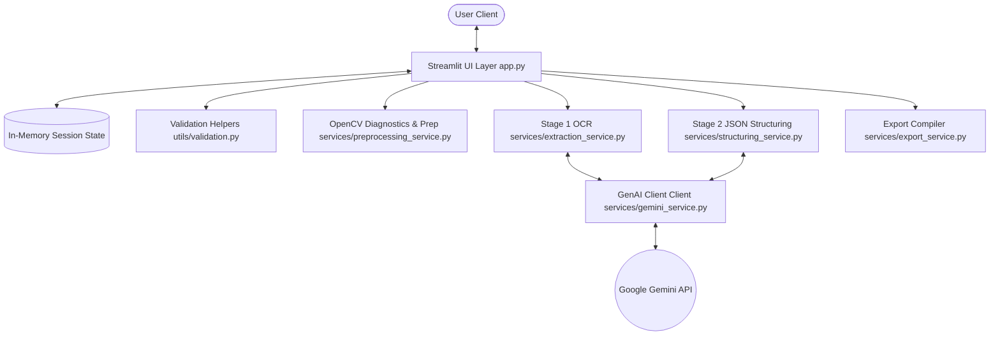
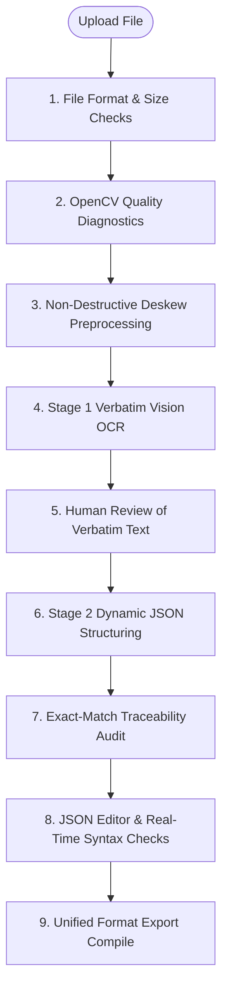
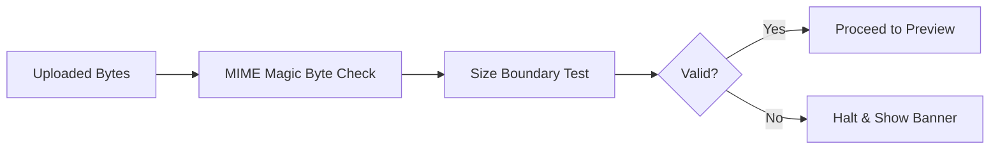
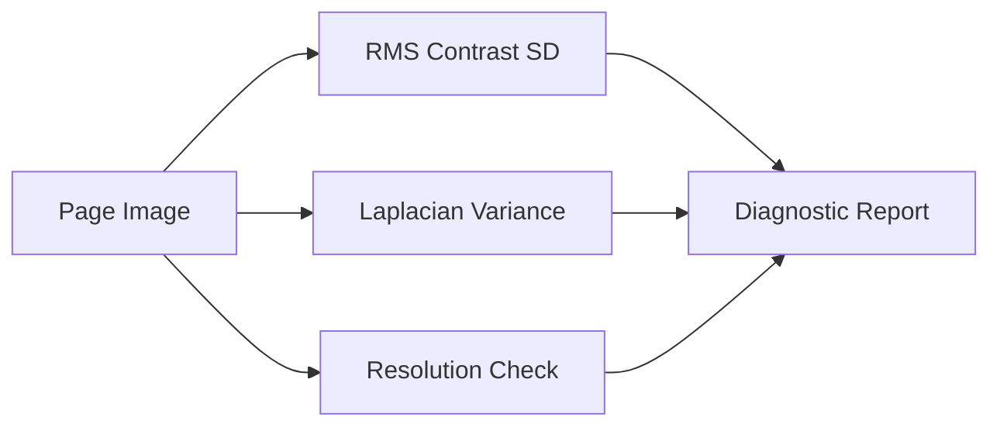
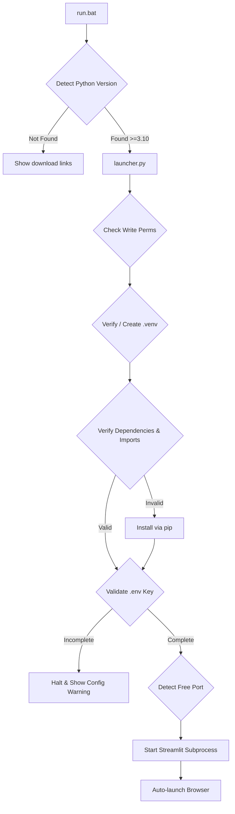

# Nobeth Universal OCR

> **Extract. Understand. Structure.**  
> A standalone, single-server document intelligence workstation powered by **Google Gemini 3.1 Flash-Lite** and **Streamlit**.

[](https://github.com/sankaran-s2001/Nobeth-Universal-OCR)
[](https://python.org)
[](https://opensource.org/licenses/MIT)

**Nobeth Universal OCR** is a modern, high-accuracy document intelligence workspace designed to extract and structure information from almost any image or document format without rigid, pre-defined templates.

The application operates on a **universal two-stage architecture** combining Computer Vision and LLMs. First, it performs a source-faithful, verbatim extraction of all visible text, tables, and handwriting. Second, it dynamically infers the document type, parses the text into a clean JSON schema, and checks data provenance through exact-match traceability linkages.

---

## 🎯 Aim

The aim of Nobeth Universal OCR is to provide an template-free document processing workstation. The system converts raw, unformatted scans, PDFs, and images into structured, verified JSON data. It aims to eliminate coordinate-based parsing templates and enable generalized document extraction that works across receipts, invoices, IDs, medical forms, and handwritten logs.

---

## ❗ Problem

Legacy document processing architectures present major challenges:
1. **Coordinate-Based Parsing**: Traditional tools map fields to exact pixel positions. If a vendor changes a invoice layout by a few millimeters, extraction fails.
2. **Layout Variance**: Writing rules for every possible document format (utility bills, ID cards, shipping logs) leads to brittle codebases.
3. **OCR Limitations**: Standard OCR engines return unstructured text wraps without layout landmarks, losing tabular relations and handwriting.
4. **Data Provenance**: Once data is transformed by an AI model, there is no verification that the structured values exist verbatim in the source document, risking hallucination.

---

## 💡 Solution

Nobeth Universal OCR resolves these issues with a **Universal Two-Stage Pipeline**:

```text
Document Upload ➔ Preprocessing ➔ [Stage 1: Verbatim OCR] ➔ [Stage 2: Dynamic Structuring] ➔ Structured JSON
```

- **Stage 1 (Verbatim Vision Extraction)**: Gemini Vision inspects the preprocessed document page-by-page. It transcribes text verbatim, preserving exact symbols, tables, numbers, and handwritten notes without trying to format them.
- **Stage 2 (Dynamic Structuring)**: Gemini structures the raw text into an inferred JSON schema. The engine normalizes fields, groups key-values, handles arrays of nested items, and maps values back to the source text via exact-match trace logic.

---

## 👥 Who Is This For?

- **Developers**: Building document extraction integrations without writing templates.
- **Analysts & Operations Teams**: Converting paper receipts and PDF invoices into tables.
- **Data Engineers**: Ingesting unstructured documentation logs into databases.
- **Researchers**: Transcribing mixed handwritten and printed materials.

---

## 📌 When Should You Use It?

Use this application when you need to process layouts containing:
* **Financial Sheets**: Invoices, receipts, expense reports, billing ledgers.
* **ID & Certificates**: Passports, national identification cards, drivers licenses.
* **Handwritten Records**: Lab diaries, engineering logs, signed documents.
* **Tabular Matrices**: Complex multi-page documents containing bordered or borderless tables.

---

## 🌍 Where Does It Run?

- **Local Windows Execution**: Easiest startup via a zero-interaction, self-healing batch launcher (`run.bat`).
- **Developer Environments**: Runs inside PowerShell, bash, or CMD shells using standard Python virtual environments.
- **Cloud Deployment**: Built to deploy on PaaS servers (like Render) as a stateless, single-server Streamlit process.
- **No Database Dependency**: Runs entirely in-memory using `st.session_state` with no external database requirements.

---

## ✨ Key Features

- **Multi-Format Ingestion**: Supports PDF, JPG, PNG, WEBP, HEIC, and TIFF.
- **OpenCV Diagnostics**: Computes image brightness, RMS contrast, Laplacian blur metrics, and resolution bounds before extraction.
- **Adaptive Deskew**: Detects contour orientations and rotates images horizontally if alignment issues exist.
- **Verbatim OCR (Stage 1)**: Visual extraction preserving tables, symbols, and layout structure.
- **Dynamic JSON Structuring (Stage 2)**: Dynamic schema inference mapping unstructured text into custom JSON.
- **Exact-Match Traceability**: Highlights data provenance by matching structured values back to the raw verbatim string.
- **Interactive Workspaces**: Side-by-side editing panes for raw text and structured JSON with live syntax checking.
- **Unified Exports**: Instantly download results as **JSON**, **CSV** (intelligent flattener), or **TXT** formats.
- **Self-Healing Launcher**: Automated dependency checkers, version compliance validation, port scanning, and instance re-use.

---

## 🏗️ High-Level Architecture

The system is designed as a modular, single-server Python application:



---

## 🔄 Complete End-to-End Workflow

The processing flow follows a sequential structure:



### Steps Description

1. **Upload & Check**: The file is uploaded, and magic bytes are inspected to prevent extension renaming attacks.
2. **Diagnostics**: Metrics are computed (contrast, blur, resolution) to warn if document readability is poor.
3. **Deskewing**: Image contours are assessed and rotated if skewed.
4. **Stage 1 (Vision OCR)**: The preprocessed page images are sent to Gemini to extract all visible text.
5. **Verbatim Review**: The user reviews the raw extraction and can fix spelling or character mistakes in the editor.
6. **Stage 2 (Structuring)**: The reviewed verbatim text is analyzed by Gemini to extract structured fields.
7. **Traceability**: The system checks if the structured values exist verbatim in the raw text to verify accuracy.
8. **JSON Review**: The structured data is shown in a JSON editor with live syntax checking.
9. **Export**: Stored data is exported into JSON, CSV, or TXT file bundles.

---

## 🔬 Important Phase Workflows

### Phase 1 - File Validation
- **Purpose**: Prevent invalid uploads and confirm file integrity.
- **Input**: Raw uploaded bytes and filename.
- **Processing**: Reads magic bytes to verify MIME types. Inspects file size boundary limits. If PDF, PyMuPDF opens it to check if it's password protected or corrupted.
- **Output**: Boolean success flag, file extension, and any validation messages.
- **Possible Failures**: Unsupported format, corrupted PDF structure, size boundary exceeded.



### Phase 2 - Quality Diagnostics
- **Purpose**: Score readability and warn if processing is likely to fail.
- **Input**: Original document page images.
- **Processing**: 
  - Calculates RMS standard deviation for contrast.
  - Computes Laplacian variance for sharpness/blur.
  - Checks dimensions for resolution limits.
- **Output**: Diagnostic scores and a readability rating (`GOOD`, `WARNING`, `POOR`).



### Phase 3 - Preprocessing
- **Purpose**: Rectify document alignment before sending to the vision model.
- **Input**: Original document page images.
- **Processing**: Evaluates edge contours using OpenCV. If the contour skew exceeds 1.5 degrees, it performs a non-destructive affine rotation.
- **Output**: Aligned page images.

### Phase 4 - Raw OCR / Vision Extraction
- **Purpose**: Verbatim transcription of all text, tables, and handwritten symbols.
- **Input**: Preprocessed page images.
- **Processing**: Builds user/system prompts and submits page payloads to the Gemini Vision Client.
- **Output**: Verbatim text output containing document layout and structural markers.

### Phase 5 - Human Review
- **Purpose**: Allow correction of transcriptions before structuring.
- **Input**: AI Verbatim extraction text.
- **Processing**: Renders the raw text inside a Streamlit workspace text editor. Human edits are preserved in session memory.
- **Output**: Reviewed verbatim text.

### Phase 6 - Dynamic Structuring
- **Purpose**: Parse raw text into structured JSON.
- **Input**: Reviewed verbatim text and document type hint.
- **Processing**: Prompts Gemini to infer schemas, group data keys, parse nested items, and export structured JSON.
- **Output**: Structured JSON string.

### Phase 7 - Traceability / Validation
- **Purpose**: Ensure extraction accuracy.
- **Input**: Structured JSON and Reviewed verbatim text.
- **Processing**: Traverses the JSON structure, checking if every value exists in the raw verbatim text.
- **Output**: List of field trace mappings, validation status, and error messages.

### Phase 8 - Export
- **Purpose**: Package extraction results for ingestion.
- **Input**: Structured JSON, verbatim text, filename, and confidence scores.
- **Processing**: Generates indented JSON. Flattens data to CSV, duplicating scalar keys across line items. Formats raw text into a TXT file.
- **Output**: Downloadable ZIP/file bundle (`ExportBundle`).

---

## 🧑💻 How the User Uses the Application

1. **Upload**: Drag-and-drop your image or PDF into the left panel dropzone.
2. **Review Preview & Diagnostics**: View the rendering. Check the **Document Readiness Diagnostic Panel** for warnings on low contrast or blur.
3. **Extract Text**: Click **🚀 Run Gemini Vision Extraction**. The verbatim text will load into Tab 1 of the right workspace column.
4. **Edit Raw Text**: Review the extracted text. If any character is transcribed incorrectly, edit it directly in the text editor.
5. **Structure JSON**: Click **✨ Convert to Dynamic JSON**. The JSON output will display in Tab 2.
6. **Validate & Export**: If you modify the JSON, the status badge will update. Click the **JSON**, **CSV**, or **TXT** buttons to download your files.

---

## 📥 Inputs

| Format | Extensions | Maximum Size | Multi-Page Behavior |
| :--- | :--- | :--- | :--- |
| **PDF** | `.pdf` | 50 MB | PyMuPDF renders pages to images. Navigated via Prev/Next buttons. |
| **JPEG** | `.jpg`, `.jpeg` | 50 MB | Single page visualization. |
| **PNG** | `.png` | 50 MB | Single page visualization. |
| **WEBP** | `.webp` | 50 MB | Single page visualization. |
| **HEIC** | `.heic` | 50 MB | Converted via Pillow-HEIF for rendering. |
| **TIFF** | `.tiff`, `.tif` | 50 MB | Single page visualization. |

---

## 📤 Outputs

- **Structured JSON**: Dynamic schema nested representation.
- **Intelligent CSV**: If line items exist, it flattens them into tabular rows with repeated scalar values. If no array exists, it exports key-value pairs in a two-column format.
- **Verbatim TXT**: The human-reviewed verbatim text file.

---

## 🧾 Raw Extraction Example
For a sample invoice layout:
```text
=== METADATA ===
DOCUMENT_TYPE: invoice
CONFIDENCE_LEVEL: HIGH
CONFIDENCE_SCORE: 0.98

=== RAW_TEXT ===
NOBETH ANALYTICS LTD
G-Sector, Tech Workspace

Invoice No: INV-2026-901
Date: 2026-08-14

Description                         Qty    Price      Amount
Document Intelligence Consultation   1     750.00     750.00
Gemini API Operations Support        5     120.00     600.00

Subtotal: 1350.00
Tax (8%): 108.00
Grand Total: 1458.00
```

---

## 🧠 Structured JSON Example

Using the raw extraction above, Stage 2 generates the following JSON output:
```json
{
  "document_type": "invoice",
  "invoice_number": "INV-2026-901",
  "issue_date": "2026-08-14",
  "vendor": {
    "name": "Nobeth Analytics Ltd",
    "address": "G-Sector, Tech Workspace"
  },
  "line_items": [
    {
      "description": "Document Intelligence Consultation",
      "quantity": 1,
      "unit_price": 750.0,
      "amount": 750.0
    },
    {
      "description": "Gemini API Operations Support",
      "quantity": 5,
      "unit_price": 120.0,
      "amount": 600.0
    }
  ],
  "totals": {
    "subtotal": 1350.0,
    "tax": 108.0,
    "grand_total": 1458.0
  }
}
```

---

## 🔍 Traceability / Accuracy

Structured values are checked against the verbatim text to confirm accuracy:
- **Traceability Check**: Traverses the parsed JSON dictionary and searches the verbatim text for exact value matches.
- **Traceability Report**: If a value is found in the verbatim text, it is marked as `HIGH` confidence. If missing, it is flagged as `MEDIUM` or `LOW` confidence.
- **HALLUCINATION Warning**: If values are generated that do not exist in the source verbatim, they are marked in the trace report to highlight potential hallucinations.

---

## 🛠️ Technology Stack

| Layer | Technology | Purpose |
| :--- | :--- | :--- |
| **Frontend** | Streamlit (v1.46.0) | Multi-column layout and reactive workspaces. |
| **Styling** | Vanilla CSS | Custom horizontal tabs and glassmorphism styling. |
| **AI Layer** | `google-genai` (v2.16.0) | Communication with the Gemini API. |
| **Model** | `gemini-3.1-flash-lite` | Vision extraction and structuring. |
| **Vision Diagnostics** | OpenCV (`opencv-python-headless`) | Reads dimensions, contrast, blur, and skew. |
| **PDF Renderer** | PyMuPDF (`fitz` v1.24.2) | PDF page rendering. |
| **Environment** | `python-dotenv` | Config variable loading. |
| **Testing** | `pytest` (v7.4.0) | Automated validation tests. |

---

## 📂 Project Structure

```text
Nobeth-Universal-OCR/
├── .env.example                # Template configuration parameters
├── .gitignore                  # Git exclude configurations
├── README.md                   # Project documentation
├── requirements.txt            # Python dependencies catalog
├── app.py                      # Streamlit application entry point
├── launcher.py                 # Windows self-healing launcher orchestrator
└── run.bat                     # Windows one-click shell entry point
│
├── models/
│   ├── __init__.py
│   └── schemas.py              # Pydantic data schemas and Enums
│
├── prompts/
│   ├── __init__.py
│   ├── extraction_prompt.py    # Instructions for Stage 1 Verbatim OCR
│   └── structuring_prompt.py   # Instructions for Stage 2 JSON Structuring
│
├── services/
│   ├── __init__.py
│   ├── export_service.py       # JSON stringifiers, CSV flattener, TXT export writer
│   ├── extraction_service.py   # Orchestrator for Gemini Vision Stage 1 OCR
│   ├── gemini_service.py       # Client for GenAI SDK with exponential backoffs
│   ├── preprocessing_service.py# OpenCV image diagnostic scoring and rotation deskewing
│   └── structuring_service.py  # Orchestrator for Gemini JSON Stage 2 Structuring
│
├── tests/
│   ├── __init__.py
│   ├── test_exports.py         # Tabular list and scalar export tests
│   ├── test_formats_and_pipeline.py # PDF page rendering and mock pipeline tests
│   ├── test_preprocessing.py   # Contrast, blur variance, and deskew checks
│   ├── test_structuring.py     # Field traceability and numeric checks
│   └── test_validation.py      # File type and JSON repair testing
│
└── sample_data/
    ├── sample_doc.pdf          # Sample multi-page PDF document
    └── sample_invoice.jpg      # Sample invoice image
```

---

## 🧩 Core Modules and Functions

- **`services/preprocessing_service.py`**: Runs diagnostics (`assess_document_readiness`) and rotates skewed images (`preprocess_document_for_vision`).
- **`services/extraction_service.py`**: Submits page payloads to the Gemini API (`extract_raw_document`) and parses metadata headers (`parse_extraction_response`).
- **`services/structuring_service.py`**: Submits raw text for structuring (`structure_raw_extraction`) and generates exact-match traceability linkages (`extract_field_traceability`).
- **`services/export_service.py`**: Formats outputs (`export_to_json`, `export_to_csv`, `export_to_txt`) and creates download bundles (`create_export_bundle`).
- **`utils/validation.py`**: Performs upload byte checks (`validate_upload_bytes`) and handles JSON parsing and repair (`parse_and_validate_json`).

---

## ⚙️ Configuration

| Variable | Required | Default | Purpose / Example |
| :--- | :--- | :--- | :--- |
| **`GEMINI_API_KEY`** | **Yes** | *None* | Google Gemini API credentials (`AIzaSy...`). |
| **`GEMINI_MODEL`** | No | `gemini-3.1-flash-lite` | Target model for vision extraction and structuring. |
| **`MAX_FILE_SIZE_MB`** | No | `50` | Maximum allowed file upload size. |

---

## 💻 Requirements

- **Python Version**: `3.10`, `3.11`, or `3.12` (Python `3.11` is recommended).
- **Operating Systems**: Windows, macOS, Linux.
- **Internet Connection**: Required to connect to the Gemini API.
- **API Key**: A valid Google Gemini API Key.

---

## 🆕 Fresh Laptop Setup

1. **Install Python**: Download and install Python 3.11 from [python.org](https://www.python.org/downloads/). Ensure you check "Add Python to PATH" during installation.
2. **Download the Project**: Download and extract the project folder to your system.
3. **Create Environment File**: Duplicate `.env.example` in the project root, rename it to `.env`, and add your API key:
   ```ini
   GEMINI_API_KEY=your_actual_key_here
   ```
4. **Launch**:
   - **Windows**: Double-click **[run.bat](file:///g:/Nobeth%20Analytics/Projects/Nobeth%20Universal%20OCR/Codebase/run.bat)**.
   - **macOS/Linux**: Follow the manual commands below.

---

## 🪄 One-Click Windows Launcher

The application features a self-healing launcher (`run.bat` and `launcher.py`):



### Self-Healing Logic
- **Venv Creation**: Automatically creates `.venv` if missing or corrupted.
- **Dependency Cache**: Hashes `requirements.txt` via SHA-256 and caches it to skip pip updates. Checks core imports (`streamlit`, `google.genai`, `pydantic`, `PIL`, `cv2`, `fitz`, `dotenv`) before skipping installation.
- **No-Interactive Config**: Copies `.env.example` to `.env` if missing. Halts with a warning if the API key is not configured.
- **Port Manager**: Scans for a free port starting at `8501`.
- **Duplicate Run Prevention**: Logs active PIDs. If run again, it opens the existing browser session and exits to prevent conflicts.

---

## 🧑🔧 Manual Developer Setup

### Windows (PowerShell)
```powershell
# Set up environment
python -m venv .venv
.venv\Scripts\activate

# Install requirements
pip install -r requirements.txt

# Configure settings
cp .env.example .env

# Run app
streamlit run app.py
```

### macOS / Linux (Terminal)
```bash
# Set up environment
python3 -m venv .venv
source .venv/bin/activate

# Install requirements
pip install -r requirements.txt

# Configure settings
cp .env.example .env

# Run app
streamlit run app.py
```

---

## 🧪 Testing

The test suite uses `pytest`. Run tests using the command below:
```bash
pytest tests/ -v
```

Tests verify image preprocessing, quality calculations, file type checks, PDF parsing, traceability logic, and JSON exports.

---

## 🧯 Error Handling

- **Invalid Uploads**: Triggers error banners for unsupported file types.
- **Missing API Configuration**: Halts processing with instructions to add your key to `.env`.
- **API Exceptions**: GenAI client implements 3 retries with exponential backoffs for transient errors.
- **Syntax Errors**: Invalid edits in the JSON editor are flagged with syntax badges. Exports are disabled until resolved.

---

## 🔧 Troubleshooting

| Problem | Cause | Solution |
| :--- | :--- | :--- |
| **API Error / 401 Unauthorized** | Missing or incorrect API key. | Set a valid `GEMINI_API_KEY` in your `.env` file. |
| **ImportError: libGL.so.1** | Missing native GUI libraries in cloud Linux environment. | Verify that `opencv-python-headless` (and not GUI `opencv-python`) is in your `requirements.txt`. |
| **JSON Export Disabled** | Hand-edited JSON in the workspace has syntax errors. | Edit the text to resolve syntax errors. A status banner will display the exact error line. |
| **Venv creation failed on Windows** | Execution Policy restriction. | Run `run.bat` as Administrator, or run `Set-ExecutionPolicy -Scope Process Bypass` in PowerShell. |

---

## ☁️ Deployment

Deploy to Render (https://render.com/) with these parameters:
- **Build Command**: `pip install -r requirements.txt`
- **Start Command**: `streamlit run app.py --server.port $PORT --server.address 0.0.0.0`
- **Variables**: `PYTHON_VERSION` = `3.11.7`, `GEMINI_API_KEY` = *[Your actual key]*

---

## 📊 Performance / Limitations

- **API Limits**: Subject to Gemini rate limits (RPM/TPM).
- **File Limits**: Defaults to 50MB per upload.
- **Render Cold Starts**: Render's free tier web services spin down after 15 minutes of inactivity, requiring ~30-50 seconds to boot on subsequent access.

---

## 🔐 Security Notes

- **Secrets Management**: Never commit your `.env` file containing API keys.
- **Input Validation**: The app uses magic byte verification to block renamed malicious file uploads.
- **Headless Packages**: Headless OpenCV is used to keep server-side operations secure.

---

## 🔮 Future Improvements

* Support for batch directory ingestion.
* Multi-document schema comparisons.
* Integration of offline local LLMs.

---

## 📖 Glossary

| Term | Meaning |
| :--- | :--- |
| **OCR** | Optical Character Recognition. Reading text from images. |
| **Deskew** | Automatically correcting the tilt/rotation of an image. |
| **Traceability** | Connecting structured database values back to their exact original text occurrence. |
| **Headless** | Running software on a server without visual user interface components. |
| **Session State** | Temporary in-memory variable storage maintained throughout a user session. |

---

## ❓ FAQ

**What does this project do?**  
It extracts unstructured text from documents and maps it into clean JSON data.

**Does it need a database?**  
No. State is managed locally in-memory.

**Can it process PDFs?**  
Yes. PDF pages are rendered as images for vision processing.

**What API key is required?**  
A Google Gemini API key.

**Can I run it with one click?**  
Yes, double-click `run.bat` on Windows.

---

## 📌 Final Quick Reference

```text
Project      : Nobeth Universal OCR
Frontend     : Streamlit
AI           : Gemini
Runtime      : Python
Entry Point  : app.py
Windows Run  : run.bat
Configuration: .env
Tests        : pytest
```
